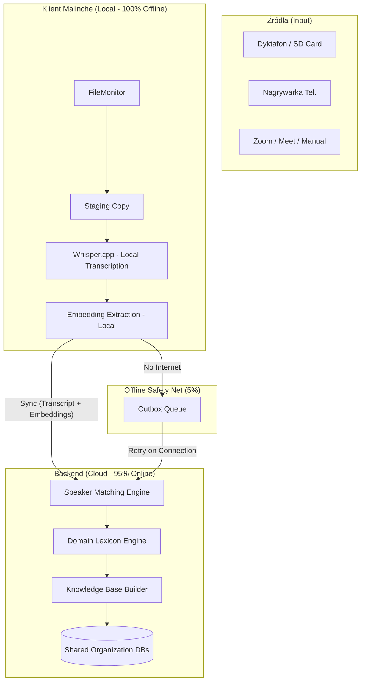
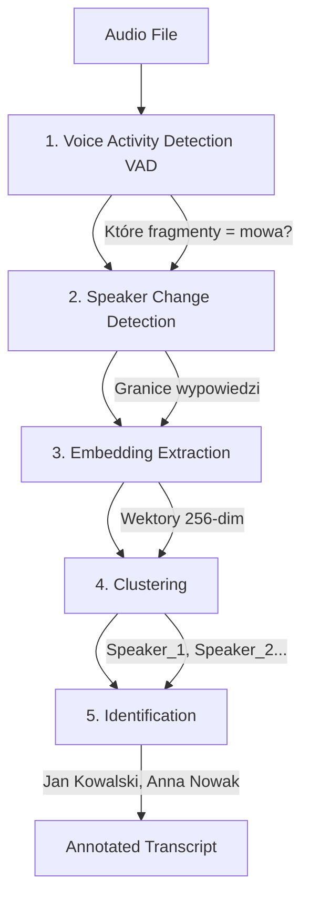
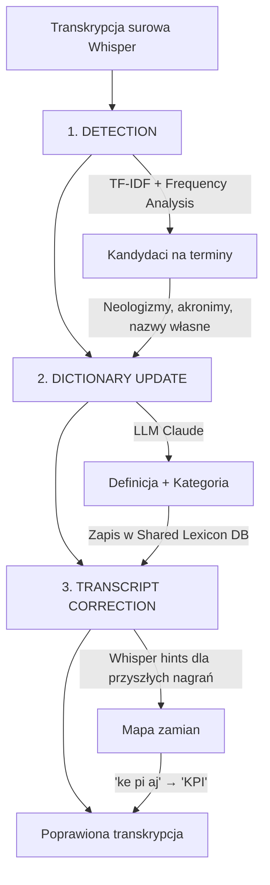
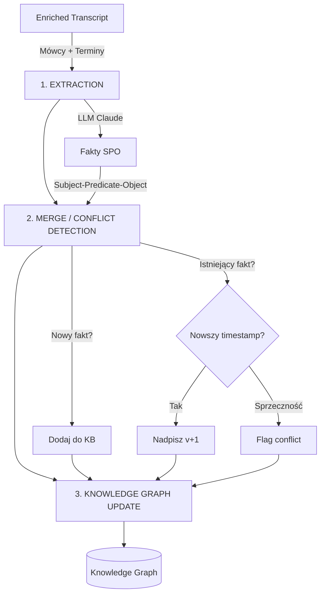
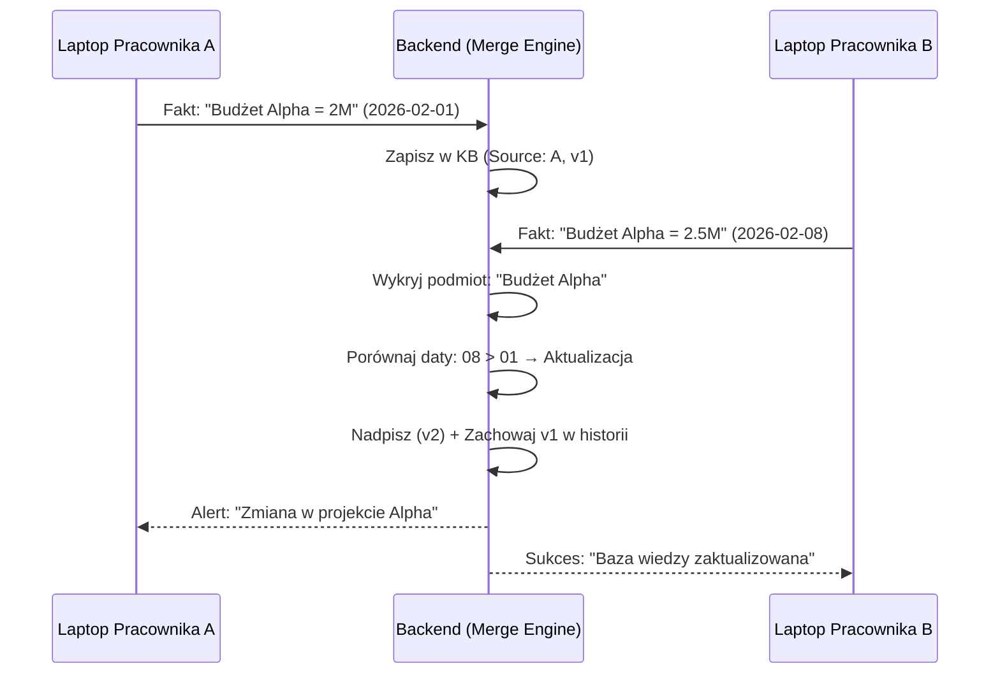

# Analiza architektoniczna: Knowledge Base Engine (PRO)

## 1. Wstęp i Wizja Produktu

Zarządzanie wiedzą w organizacjach operujących "w terenie" oraz hybrydowo (spotkania online) jest kluczowym wyzwaniem. Wiedza przekazywana ustnie – podczas narad na budowie, przesłuchań w kancelarii, czy spotkań na Zoom – często ginie w szumie informacyjnym.

Malinche (v2.2.0+) przekształca proces z "nagrywania audio" w "budowanie aktywnej bazy wiedzy".

### Główne cele:
1. **Wielokanałowość:** Obsługa dyktafonów (USB/SD), nagrywarek telefonicznych oraz spotkań online (Zoom/Meet).
2. **Atrybucja:** Precyzyjne przypisanie wypowiedzi do osób niezależnie od źródła dźwięku.
3. **Adaptacja:** Nauka specyficznego języka organizacji (Domain Lexicon).
4. **Konsolidacja:** Łączenie faktów z wielu nagrań różnych pracowników w jeden spójny graf wiedzy (Knowledge Base).

---

## 2. Wysokopoziomowa Architektura (Hybrid Cloud)

Architektura opiera się na zasadzie **Local-first Processing, Cloud-primary Intelligence**. Transkrypcja zawsze dzieje się lokalnie, natomiast zaawansowana analiza wiedzy i diaryzacja dla organizacji odbywają się w chmurze (transrec-backend), co gwarantuje spójność danych w całej firmie.



---

## 3. Źródła nagrań i ich specyfika

System automatycznie rozpoznaje typ źródła i dostosowuje pipeline przetwarzania:

1. **Dyktafony / Rejestratory (Mono/Stereo):**
   - Często niska jakość, echo, szum tła.
   - Wymaga zaawansowanej diaryzacji opartej na ML (embeddingi głosowe).
2. **Zoom / Google Meet (Multi-track):**
   - Jeśli plik zawiera oddzielne ścieżki audio dla uczestników, system stosuje **Trivial Diarization** (100% pewności bez użycia ML).
   - Obsługiwane przez "Watched Folder" lub ręczne przeciągnięcie pliku.
3. **Nagrywarki telefoniczne:**
   - Specyficzna kompresja audio.

---

## 4. Komponent 1: Speaker Diarizer (Cloud-Primary)

**Cel:** Odpowiedź na pytanie "Kto mówi kiedy?" w skali całej organizacji.

### 4.1. Czym są Voice Embeddings?

**Voice embedding** to wektor liczbowy (256-512 wymiarów) reprezentujący unikalne cechy głosu osoby. Analogiczny do odcisku palca, ale dla dźwięku.

Embedding koduje:
- Wysokość głosu (pitch)
- Barwa (timbre)
- Tempo mówienia
- Wzorce intonacji
- Rezonanse (formanty)

**Kluczowa właściwość:** To jednokierunkowa transformacja - z embeddingu NIE DA SIĘ odtworzyć głosu. Dwa embeddingi tej samej osoby są blisko siebie w przestrzeni wektorowej (niska odległość cosinusowa), nawet jeśli mówi różne słowa.

### 4.2. Pipeline techniczny (5 kroków)



**Opis kroków:**
1. **VAD:** Wykrywa fragmenty zawierające mowę vs cisza/szum
2. **Segmentation:** Znajduje punkty zmiany mówcy
3. **Embedding Extraction:** Generuje fingerprint dla każdego segmentu
4. **Clustering:** Grupuje podobne embeddingi → anonimowe ID mówców
5. **Identification:** Porównuje z bazą `speakers.db` → przypisuje nazwiska

### 4.3. Integracja z Whisper.cpp

Obecny kod Malinche używa flagi `-otxt` w wywołaniu whisper.cpp (plik tekstowy). Dla diaryzacji potrzebujemy **timestampów**:

```python
# OBECNE (src/transcriber.py, linia ~440):
whisper_cmd = [
    str(self.config.WHISPER_CPP_PATH),
    "-m", str(model_path),
    "-f", str(audio_file),
    "-otxt",  # ← Tylko tekst, bez timestampów
    "-of", str(output_base),
]

# WYMAGANE dla diaryzacji:
whisper_cmd = [
    str(self.config.WHISPER_CPP_PATH),
    "-m", str(model_path),
    "-f", str(audio_file),
    "-ojf",  # ← JSON z timestampami per segment
    "-of", str(output_base),
]
```

Format JSON zawiera strukturę:
```json
{
  "transcription": [
    {"start": 0.0, "end": 4.2, "text": "Spotkajmy się w czwartek"},
    {"start": 4.2, "end": 8.1, "text": "Ok, ale muszę sprawdzić z Anną"}
  ]
}
```

Diarizer dopasowuje swoje segmenty do segmentów Whisper po timestampach.

### 4.4. Strategia 95/5 (Online/Offline)
- **95% przypadków (Online przy przetwarzaniu):** System wysyła do backendu tekst transkrypcji oraz **voice embeddings** (wektory numeryczne, nie surowe audio). Backend dopasowuje je do `Shared Speaker DB`.
- **5% przypadków (Offline):** Nagranie zostaje przetworzone lokalnie (tylko transkrypcja), a proces diaryzacji trafia do kolejki `Outbox`. Po odzyskaniu sieci markdown jest wzbogacany o dane mówców.

### 4.5. Modele i prywatność
- **Lokalnie:** Lekki model do ekstrakcji embeddingów (~17MB, np. resemblyzer).
- **Cloud:** Ciężkie modele (pyannote.audio) na serwerach z GPU dla najwyższej jakości.
- **Opcja PRO:** Organizacja może wybrać między wysyłaniem tylko embeddingów (wyższa prywatność) a surowym audio (wyższa jakość diaryzacji).

### 4.6. Porównanie dostępnych narzędzi

| Narzędzie | Rozmiar modelu | Licencja | Plusy | Minusy | Rekomendacja |
|-----------|---------------|----------|-------|--------|--------------|
| **pyannote.audio** | ~500MB + PyTorch | MIT | State-of-the-art, pipeline E2E, aktywnie rozwijany | Wymaga PyTorch (~500MB dependencji) | ✅ **Backend (GPU)** |
| **resemblyzer** | ~17MB | Apache 2.0 | Bardzo lekki, szybki | Tylko embeddingi - brak VAD/segmentacji | ✅ **Klient (embedding extraction)** |
| **whisperX** | ~500MB | BSD | Zintegrowane z Whisper | Duplikuje transkrypcję (używa Python Whisper, nie .cpp) | ❌ Niekompatybilne |
| **NeMo (NVIDIA)** | ~2GB+ | Apache 2.0 | Bardzo dobra jakość | Za ciężki, wymaga CUDA (nie działa na Metal) | ❌ Za ciężki |
| **API (AssemblyAI)** | 0 (cloud) | Komercyjne | Najlepsza jakość, zero dependencji | Prywatność, $0.37/godz, wymaga internetu | ⚠️ Opcja dla PRO Individual |
| **ONNX Runtime** | ~50MB | MIT | Kompromis wagi/jakości | Wymaga konwersji modeli pyannote | 🔄 Rozważyć w przyszłości |

**Rekomendowana architektura:**
- **Klient:** resemblyzer (lekki) do generowania embeddingów
- **Backend:** pyannote.audio (najlepsza jakość) do pełnej diaryzacji na GPU

### 4.7. Modele danych

```python
from dataclasses import dataclass
from datetime import datetime
from typing import Optional
import numpy as np

@dataclass
class SpeakerSegment:
    """Segment transkrypcji przypisany do mówcy."""
    speaker_id: str              # "speaker_001" lub "jan_kowalski"
    speaker_name: Optional[str]  # Rozpoznana nazwa lub None
    start_time: float            # Sekundy od początku nagrania
    end_time: float
    text: str                    # Tekst wypowiedzi
    confidence: float            # 0.0-1.0 (pewność przypisania)

@dataclass
class SpeakerProfile:
    """Profil głosowy osoby w organizacji."""
    id: str                      # UUID
    name: str                    # np. "Jan Kowalski"
    department: Optional[str]    # np. "Finanse"
    voice_embedding: np.ndarray  # Wektor 256/512-dim (fingerprint)
    created_at: datetime
    last_seen: datetime
    recording_count: int         # Ile razy wykryto w nagraniach
```

### 4.8. Scenariusze użycia (Case Studies)

**Scenariusz A: "Wieczorny sync"**
```
09:00 - Ania nagrywa spotkanie z Janem i nieznaną osobą (dyktafon offline)
17:00 - Ania wraca do biura, podłącza dyktafon do laptopa (WiFi dostępne)
17:05 - Malinche transkrybuje lokalnie (whisper.cpp)
17:08 - Embeddingi lecą na backend
17:09 - Backend rozpoznaje Jana (znany profil), nieznana osoba = "Speaker_2"
17:10 - Ania taguje "Speaker_2" jako "Tomasz Wiśniewski"
17:11 - Backend zapisuje nowy profil Tomasza do Shared Speaker DB
```

**Scenariusz B: "Batch piątkowy"**
```
Pon-Czw - Marek nagrywa 15 spotkań w terenie (brak sieci przez cały tydzień)
Piątek  - Wraca do biura, podłącza dyktafon
        - Malinche przetwarza batch 15 nagrań (kolejka)
        - Wszystkie embeddingi + transkrypcje lecą na backend
        - Backend rozpoznaje 12 z 15 mówców (już w bazie dzięki Ani)
        - 3 nowe osoby wymagają tagowania
```

**Scenariusz C: "Merge conflict"**
```
Tydzień 1 - Ania nagrywa spotkanie z nieznaną osobą
          - Lokalnie taguje jako "Tomek z budowy"
          - Backend zapisuje profil (embedding_A)
          
Tydzień 2 - Marek nagrywa spotkanie z tą samą osobą
          - Lokalnie taguje jako "Tomasz Wiśniewski"
          - Backend wykrywa podobieństwo embeddingów (0.92 similarity)
          - System flaguje: "Conflict: Tomek z budowy vs Tomasz Wiśniewski"
          - Admin organizacji merguje profile ręcznie
```

---

## 5. Komponent 2: Domain Lexicon Engine

**Cel:** Budowanie wspólnego słownika branżowego organizacji, który **ulepsza się z każdym nagraniem**.

### 5.1. Mechanizm Self-Improving Loop

System tworzy zamknięty cykl uczenia się języka firmy:



### 5.2. Pięciowarstwowa detekcja terminów branżowych

Rozpoznawanie terminologii branżowej to problem **wielowarstwowej detekcji anomalii językowej**. System używa pięciu warstw - od najtańszych (lokalnych) po najdroższe (LLM).

#### Warstwa 1: Sygnały z Whispera (KOSZT: 0, LOKALNIE)

Whisper.cpp w formacie JSON (`-ojf`) zwraca **confidence score** per token:

```json
{
  "tokens": [
    {"text": "Musimy", "p": 0.97},
    {"text": " przeanalizować", "p": 0.95},
    {"text": " ke", "p": 0.42},      // ← niskie confidence!
    {"text": " pi", "p": 0.38},
    {"text": " aj", "p": 0.35},
    {"text": " dla", "p": 0.96}
  ]
}
```

**Heurystyki detekcji:**
- Sekwencja tokenów z confidence < 0.5 otoczona tokenami z confidence > 0.8 → **silny kandydat**
- Niespójne transkrypcje tego samego fragmentu w różnych nagraniach
- Tokeny wyglądające jak "literowanie" (pojedyncze litery/sylaby)
- Nagłe przełączenie języka w tokenach

#### Warstwa 2: Analiza leksykalna (KOSZT: ~0, LOKALNIE)

**A) Słownik ogólny (hunspell/aspell):**
- Słowo NIE znajduje się w słowniku polskim ani angielskim → kandydat
- Narzędzia: `pyhunspell` / `pyspellchecker` (~5MB, offline)

**B) Wzorce morfologiczne:**
```python
# Wzorce wykrywane automatycznie:
- CamelCase: "eBOK", "iPhone", "PowerBI"
- Wielkie litery w środku: "SCM", "KPI", "GDPR"
- Cyfry wplecione: "S3", "p2p", "B2B"
- Hybrydowe odmiany: "KPI-owy", "sprint-owanie", "cloud-owej"
```

**C) Detekcja akronimów:**
```python
# Pattern matching na literowane akronimy:
SPELLED_PATTERNS = [
    r'\b([a-z])\s+([a-z])\s+([a-z])\b',  # "k p i" (spacje)
    r'\b\w{1,2}\s\w{1,2}\s\w{1,2}\b',     # "ke pi aj" (sylaby)
]
```

#### Warstwa 3: Analiza statystyczna (KOSZT: niski, BACKEND)

**A) TF-IDF względem korpusu referencyjnego:**

```python
for word in transcript_words:
    tf_org = frequency_in_org_recordings(word)    # Jak często w firmie?
    df_general = frequency_in_general_corpus(word) # Jak często ogólnie?
    
    specificity = tf_org / (df_general + epsilon)
    
    if specificity > THRESHOLD:
        mark_as_candidate(word)
```

**Korpus referencyjny:** Polish National Corpus (NKJP, 1.8 mld słów) lub Apertium frequency lists (~100k słów, ~1MB).

**Przykład:** Słowo "sprint" w języku ogólnym: DF = 0.001%. W firmie IT: TF = 2.5%. Stosunek: 2500:1 → silny kandydat.

**B) Burstiness (klasterowość):**
- Termin branżowy: 15 razy na jednym spotkaniu, 0 razy na 5 następnych, potem 20 razy
- Normalne słowa: bardziej równomierny rozkład
- Metryka: Gini coefficient częstości per nagranie

**C) Speaker specificity:**
- Termin branżowy: używany przez 5+ osób w organizacji
- Metryka: `unique_speakers_count / total_speakers`

#### Warstwa 4: Analiza kontekstowa (KOSZT: średni, BACKEND)

**Problem:** Słowo **istnieje** w słowniku, ale jest użyte w **nietypowym kontekście**.

**Przykłady:**
- "pipeline" ogólnie = rurociąg; w sprzedaży = lejek sprzedażowy; w IT = ciąg przetwarzania
- "exposure" w fotografii = naświetlenie; w finansach = ekspozycja na ryzyko

**Rozwiązanie: Embeddingi + odległość kontekstowa:**

```python
from sentence_transformers import SentenceTransformer
model = SentenceTransformer('sdadas/st-polish-paraphrase-from-distilroberta')

# Typowy kontekst "pipeline" (ogólny)
general = model.encode("rurociąg transportujący ropę naftową")

# Kontekst z nagrania
org = model.encode("musimy posprzątać pipeline bo mamy za dużo leadów")

similarity = cosine_similarity(general, org)
# similarity = 0.15 → BARDZO niskie → inne znaczenie → kandydat
```

**Collocations (współwystępowanie):**
- "Pipeline" + "leady" + "konwersja" → kontekst nietypowy
- Jeśli collocations nie pasują do ogólnego wzorca → kandydat

#### Warstwa 5: Weryfikacja LLM (KOSZT: ~$0.01/kandydat, BACKEND)

Warstwy 1-4 redukują liczbę kandydatów o 90%. Warstwa 5 to arbiter - Claude potwierdza i wzbogaca:

```python
prompt = """
Przeanalizuj fragment transkrypcji. Zidentyfikowałem potencjalne terminy 
branżowe (oznaczone **pogrubieniem**).

Dla każdego odpowiedz:
1. Czy to termin branżowy/specjalistyczny? (tak/nie)
2. Poprawna forma (jeśli Whisper zapisał fonetycznie)
3. Kategoria: Acronym / Jargon / Process / Product / InternalName
4. Krótka definicja w kontekście

Fragment:
"Musimy przeanalizować **ke pi aj** dla projektu Alpha."

JSON output.
"""
```

**Odpowiedź:**
```json
{
  "original": "ke pi aj",
  "is_domain_term": true,
  "correct_form": "KPI",
  "canonical": "Key Performance Indicator",
  "category": "Acronym",
  "definition": "Kluczowy wskaźnik efektywności"
}
```

#### Wykrywanie wyrażeń wielowyrazowych (Multi-word expressions)

"Due diligence", "sprint review", "rachunek zysków i strat" - to frazy, nie pojedyncze słowa.

**Metody detekcji:**

1. **PMI (Pointwise Mutual Information):**
   - "due" i "diligence" prawie zawsze razem → PMI wysoki → fraza
   - "sprint" i "wtorek" rzadko razem → PMI niski → nie fraza

2. **C-value / NC-value:**
   - Klasyczny algorytm ekstrakcji terminów
   - Mierzy "terminowość" na podstawie częstości i zagnieżdżenia

3. **LLM chunking:** Claude naturalnie rozpoznaje granice fraz

#### Specyfika języka polskiego

**Wyzwania:**

1. **Code-switching (polsko-angielski):**
   - "Zróbmy call z klientem, żeby omówić scope projektu"
   - Whisper transkrybuje angielskie wstawki fonetycznie po polsku

2. **Polska fleksja na obcych rdzeniach:**
   - "KPI-owy", "sprint-owanie", "cloud-owej"
   - System musi stemować hybrydowe słowa (wyciągnąć rdzeń)

3. **Odmiana akronimów:**
   - "KPI", "KPI-ów", "KPI-em" → ten sam termin, różne formy
   - Lexicon traktuje je jako jeden byt

### 5.3. Pipeline połączony

```
Transkrypcja z Whispera (confidence scores)
        │
        ▼ (FILTR 1: ~90% słów odrzucone)
Warstwa 1: Sygnały Whispera (lokalnie, 0 kosztów)
        │
        ▼ (FILTR 2: ~95% pozostałych odrzucone)
Warstwa 2: Analiza leksykalna (lokalnie, 0 kosztów)
        │
        ▼ (FILTR 3: ~50% pozostałych odrzucone)
Warstwa 3: TF-IDF + Burstiness (backend, tanie)
        │
        ▼ (FILTR 4: ~30% pozostałych odrzucone)
Warstwa 4: Embeddingi + kontekst (backend, średnie)
        │
        ▼ (5-10 kandydatów per nagranie)
Warstwa 5: Claude LLM (backend, ~$0.10/nagranie)
        │
        ▼
Zatwierdzony termin → Shared Lexicon DB
```

**Kluczowa obserwacja:** Claude widzi tylko 5-10 kandydatów per nagranie, nie 5000 słów - koszty są kontrolowalne.

### 5.4. Współdzielona Wiedza (Shared Lexicon)

- Gdy pracownik A odkryje termin "SCM" = "Supply Chain Management", termin trafia do **Shared Lexicon DB** organizacji.
- Pracownik B przy kolejnym nagraniu automatycznie otrzymuje poprawki z tego słownika.
- System buduje **rosnącą przewagę** - im dłużej firma używa Malinche, tym lepsza jakość transkrypcji.

### 5.5. Modele danych

```python
from dataclasses import dataclass
from datetime import datetime
from typing import List, Dict, Optional

@dataclass
class TermContext:
    """Kontekst użycia terminu w nagraniu."""
    recording_id: str
    speaker_id: str
    sentence: str            # Zdanie zawierające termin
    timestamp: float         # Sekunda w nagraniu

@dataclass
class DomainTerm:
    """Termin branżowy w słowniku organizacji."""
    id: str                  # UUID
    term: str                # "KPI"
    canonical_form: str      # "Key Performance Indicator"
    definition: str          # Definicja wygenerowana przez LLM
    category: str            # "Acronym", "Technical Jargon", "Process Name"
    frequency: int           # Popularność w nagraniach organizacji
    whisper_aliases: List[str]  # ["ke pi aj", "kepi-ai", "kpi aj"]
    first_seen: datetime
    last_seen: datetime
    speakers: List[str]      # Kto używa tego terminu
    contexts: List[TermContext]  # Przykłady użycia
    confidence: float        # 0.0-1.0 (pewność że to rzeczywisty termin)
    approved: bool           # Czy zatwierdzony przez admina
```

### 5.6. Przykład działania

**Początkowa transkrypcja (Whisper):**
> "Musimy przeanalizować ke pi aj dla projektu Alpha oraz sprawdzić es si em status."

**Po 3 nagraniach z tym samym terminem:**
- System wykrywa "ke pi aj" jako kandydata (TF-IDF analysis)
- Claude analizuje kontekst: "przeanalizować [term] dla projektu" → biznesowa metryka
- Propozycja: "KPI" (Key Performance Indicator), kategoria: Acronym
- Admin zatwierdza

**Przyszłe transkrypcje automatycznie:**
> "Musimy przeanalizować **KPI** dla projektu Alpha oraz sprawdzić **SCM** status."

---

## 6. Komponent 3: Knowledge Base Builder

**Cel:** Transformacja transkrypcji w ustrukturyzowane fakty i graf wiedzy organizacji.

### 6.1. Typy wiedzy (Knowledge Entry Types)

System rozpoznaje 5 typów faktów:

1. **Fact (Fakt):** Obiektywne twierdzenie  
   *Przykład:* "Budżet projektu Alpha wynosi 2M PLN"

2. **Decision (Decyzja):** Podjęta decyzja biznesowa  
   *Przykład:* "Zdecydowaliśmy o migracji infrastruktury do AWS"

3. **Action Item (Zadanie):** Przypisane działanie  
   *Przykład:* "Jan przygotuje raport finansowy do piątku"

4. **Definition (Definicja):** Wyjaśnienie terminu wewnętrznego  
   *Przykład:* "Nasz CRM to system Salesforce z customizacją dla sprzedaży"

5. **Relation (Relacja):** Powiązanie między bytami  
   *Przykład:* "Projekt Alpha jest powiązany z kontraktem XYZ od Klienta ABC"

### 6.2. Pipeline ekstrakcji (3 kroki)



### 6.3. Knowledge Merging & Conflict Resolution

Backend pełni rolę **Merge Engine** - łączy wiedzę z wielu źródeł (pracowników, nagrań, czasów):



**Zasady mergowania:**
- **Nowsze nadpisuje starsze** - fakt z późniejszego nagrania ma priorytet
- **Sprzeczności są flagowane** - jeśli dwa fakty z tego samego dnia się kłócą, system nie decyduje automatycznie
- **Version tracking** - każdy fakt ma numer wersji i referencję do poprzednika (`supersedes`)
- **Source attribution** - każdy fakt zna swoje źródło (nagranie, mówca, timestamp)

### 6.4. Modele danych

```python
from dataclasses import dataclass
from datetime import datetime
from typing import List, Optional

@dataclass
class KnowledgeEntry:
    """Jednostka wiedzy w bazie organizacji."""
    id: str                      # UUID
    entry_type: str              # "fact", "decision", "action", "definition", "relation"
    content: str                 # Treść faktu
    subject: str                 # Podmiot (dla relacji)
    predicate: str               # Orzeczenie
    object: str                  # Dopełnienie
    source_recording: str        # ID nagrania źródłowego
    source_speakers: List[str]   # Kto to powiedział
    domain_terms: List[str]      # Powiązane terminy branżowe
    confidence: float            # 0.0-1.0
    created_at: datetime
    updated_at: datetime
    version: int                 # Wersja (1, 2, 3...)
    supersedes: Optional[str]    # ID poprzedniej wersji (jeśli nadpisuje)
    conflict: bool               # Czy jest w konflikcie z innym faktem
    tags: List[str]

@dataclass
class KnowledgeRelation:
    """Relacja w grafie wiedzy."""
    id: str
    source_id: str               # KnowledgeEntry ID
    target_id: str               # KnowledgeEntry ID
    relation_type: str           # "contradicts", "updates", "supports", "requires"
    speaker_id: Optional[str]    # Kto ustanowił relację
    recording_id: str            # W którym nagraniu
    created_at: datetime
```

### 6.5. Przykłady faktów z wersjonowaniem

**Nagranie 1 (2026-02-01, Jan Kowalski):**
```json
{
  "id": "kb_001",
  "entry_type": "fact",
  "content": "Budżet projektu Alpha wynosi 2M PLN",
  "subject": "Projekt Alpha",
  "predicate": "ma_budżet",
  "object": "2M PLN",
  "version": 1,
  "supersedes": null
}
```

**Nagranie 2 (2026-02-08, Anna Nowak):**
```json
{
  "id": "kb_002",
  "entry_type": "fact",
  "content": "Budżet projektu Alpha zwiększony do 2.5M PLN",
  "subject": "Projekt Alpha",
  "predicate": "ma_budżet",
  "object": "2.5M PLN",
  "version": 2,
  "supersedes": "kb_001"  // ← Nadpisuje poprzedni fakt
}
```

System zachowuje historię - można odpowiedzieć na pytania:
- "Jaki jest obecny budżet Alpha?" → 2.5M PLN
- "Jaki był budżet Alpha na początku lutego?" → 2M PLN
- "Kto zmienił budżet?" → Anna Nowak (2026-02-08)

---

## 7. Struktura implementacji (src/pro/)

Kod dla funkcji PRO Organization powinien być wydzielony do osobnego modułu `src/pro/` z trzema podmodułami:

```
src/
├── pro/                           # Funkcje PRO (wymagają licencji)
│   ├── __init__.py
│   │
│   ├── speaker/                   # Moduł diaryzacji
│   │   ├── __init__.py
│   │   ├── diarizer.py            # BaseDiarizer + implementacje
│   │   ├── speaker_db.py          # Zarządzanie bazą profili
│   │   ├── embeddings.py          # Ekstrakcja voice fingerprints
│   │   └── models.py              # SpeakerSegment, SpeakerProfile
│   │
│   ├── lexicon/                   # Moduł słownika branżowego
│   │   ├── __init__.py
│   │   ├── engine.py              # DomainLexiconEngine - orchestrator
│   │   ├── detector.py            # Wykrywanie nowych terminów (TF-IDF)
│   │   ├── dictionary.py          # OrgDictionary - CRUD słownika
│   │   ├── corrector.py           # Post-processing transkrypcji
│   │   └── models.py              # DomainTerm, TermContext
│   │
│   └── knowledge/                 # Moduł bazy wiedzy
│       ├── __init__.py
│       ├── builder.py             # KnowledgeBaseBuilder - orchestrator
│       ├── extractor.py           # Ekstrakcja faktów z transkrypcji (LLM)
│       ├── graph.py               # Graf wiedzy (relacje między bytami)
│       ├── merger.py              # Łączenie nowej wiedzy z istniejącą
│       ├── conflict_resolver.py   # Rozwiązywanie sprzeczności
│       └── models.py              # KnowledgeEntry, KnowledgeRelation
```

### 7.1. Storage Layout

Lokalna struktura danych w `~/Library/Application Support/Malinche/`:

```
~/Library/Application Support/Malinche/
├── config.json                    # Istniejąca konfiguracja użytkownika
├── recordings/                    # Istniejący staging dla audio
├── state.json                     # Istniejący stan (last_sync)
│
├── speakers.db                    # SQLite - Profile głosowe (PRO)
│   ├── profiles (id, name, department, created_at, last_seen, recording_count)
│   └── embeddings (profile_id, embedding_vector BLOB)
│
├── lexicon.db                     # SQLite - Słownik organizacji (PRO)
│   ├── terms (id, term, canonical_form, definition, category, frequency, approved)
│   ├── aliases (term_id, whisper_alias)
│   └── contexts (term_id, recording_id, speaker_id, sentence, timestamp)
│
├── knowledge.db                   # SQLite - Baza wiedzy (PRO)
│   ├── entries (id, entry_type, content, subject, predicate, object, version, supersedes)
│   ├── relations (id, source_id, target_id, relation_type, recording_id)
│   └── conflicts (entry_id, conflicting_entry_id, resolution_status)
│
└── embeddings/                    # Cache embeddingów (binary)
    ├── speaker_001.npy
    ├── speaker_002.npy
    └── ...
```

**Uwagi:**
- SQLite jest celowym wyborem - zero konfiguracji, offline-first, łatwa synchronizacja do backendu (dump/restore).
- Embeddingi są cache'owane jako pliki `.npy` (NumPy) dla szybkiego odczytu przy ponownym przetwarzaniu.
- Wszystkie bazy mają wersjonowanie schematu (migration-ready).

---

## 8. Ryzyka i decyzje architektoniczne

- **Prywatność (RODO):** Voice fingerprints są traktowane jako dane biometryczne. Wymagana zgoda użytkownika i polityka retencji.
- **Merge Conflicts:** Największe wyzwanie to sytuacja, gdy dwaj pracownicy niezależnie tagują tę samą osobę różnymi nazwiskami. Backend musi posiadać mechanizm deduplikacji i scalania profili (Manual Merge).
- **Zależność od sieci:** Internet jest wymagany do pełnej funkcjonalności PRO, ale system jest odporny na przerwy dzięki kolejkowaniu asynchronicznemu.

---

## 8. Ryzyka i decyzje architektoniczne

### 8.1. Prywatność (RODO/GDPR)
- **Wyzwanie:** Voice fingerprints są traktowane jako dane biometryczne w UE (RODO Art. 9 - kategoria szczególna).
- **Decyzja:** 
  - **Jawna zgoda** (opt-in, nie opt-out) przy pierwszym użyciu diaryzacji.
  - Organizacja jest **controller**, Malinche jest **processor** → wymaga DPA (Data Processing Agreement) w ToS.
  - Embeddingi przechowywane lokalnie, synchronizowane tylko za zgodą.
  - Opcja "embeddings-only" (nie wysyłać surowego audio na backend).
  - **Prawo do usunięcia** profilu głosowego musi być zaimplementowane w API backendu (soft delete = anonimizacja przeszłych nagrań, hard delete = pełne usunięcie).

### 8.2. Data Retention Policy (Minimalizacja danych)
- **Wyzwanie:** RODO wymaga "minimalizacji" - nie przechowujemy danych dłużej niż potrzeba.
- **Decyzja (proponowana polityka):**
  - **Embeddingi na backendzie:** 90 dni (potem tylko metadata)
  - **Transkrypcje na backendzie:** 0 dni (NIE przechowujemy pełnych tekstów, tylko metadata + link do źródła u klienta)
  - **Baza wiedzy:** Bez limitu czasowego (to wartość produktu), ale z prawem do exportu/usunięcia organizacji
  - **Auditlog działań:** 2 lata (dla compliance)

### 8.3. Merge Conflicts (Największe wyzwanie techniczne)
- **Problem:** Dwaj pracownicy niezależnie tagują tę samą osobę różnymi nazwiskami.
  - Pracownik A: embedding → "Tomek z budowy"
  - Pracownik B: podobny embedding (0.92 similarity) → "Tomasz Wiśniewski"
- **Decyzja:**
  - Backend porównuje wszystkie nowe embeddingi z istniejącymi (similarity threshold 0.85).
  - Jeśli wykryje duplikat, flaguje jako `pending_merge` i wysyła notyfikację do admina organizacji.
  - Admin ręcznie zatwierdza merge lub oznacza jako "różne osoby" (fałszywy pozytyw).
  - Analogiczny problem dla terminów słownika i faktów w KB.

### 8.4. Słownik: Problem "Zimnego Startu"
- **Wyzwanie:** Nowa instalacja ma pusty słownik - pierwsze 2-3 tygodnie nie dają wartości.
- **Decyzja:** 
  - **Opcja A (MVP):** System zaczyna od zera, ale szybko się uczy (po 10-15 nagraniach już widać efekt).
  - **Opcja B (Zaawansowana):** Możliwość importu "seed dictionary" z dokumentacji firmy (PDF/DOCX) przez parsowanie przed rozpoczęciem nagrywania. LLM wyciąga kluczowe terminy z dokumentów.
  - Rekomendacja: zacząć od A, dodać B jako feature w Fazie B.2.

### 8.5. Jakość diaryzacji w warunkach polowych (Quality Assurance)
- **Problem:** Ekstremalne warunki audio mogą dawać błędne wyniki:
  - Budowa: hałas maszyn, echo, wiatr
  - Samochód: szum silnika, telefon przez Bluetooth
  - Spotkania w hałaśliwej przestrzeni (kawiarnia, open space)
- **Decyzja:**
  - Wprowadzić **quality gate** przed wysłaniem do backendu (SNR - Signal-to-Noise Ratio check).
  - **Minimalny próg jakości**: SNR < 10 dB → system wyświetla warning "Jakość audio zbyt niska dla diaryzacji" zamiast zwracać błędne wyniki.
  - Transkrypcja zawsze działa (Whisper jest bardziej odporny), ale diaryzacja może być niedostępna.
  - UI komunikat: "⚠️ Diaryzacja pominięta (zbyt niski SNR). Transkrypcja gotowa."

### 8.6. Latencja backendu i UX oczekiwania (Performance SLA)
- **Problem:** Dokument mówi "95% online", ale nie definiuje ile user czeka.
- **Pytania:**
  - Ile czasu zajmuje pełny pipeline dla 30-minutowego nagrania?
  - Czy backend przetwarza w kolejce (async job queue), czy synchronicznie?
- **Decyzja (proponowany SLA):**
  - **FREE:** Transkrypcja lokalna: < 5 min (zawsze spełniona, offline)
  - **PRO Organization:** Pełny pipeline (transkrypcja + diaryzacja + lexicon + KB): < 10 min dla 30-min nagrania (99% czasu)
  - Backend używa **async job queue** (Celery/RabbitMQ/Redis) z progress tracking
  - UI pokazuje: "Przetwarzanie 2/5 (diaryzacja)... Pozostało ~3 min"
  - Rate limiting: 5 nagrań jednocześnie per organizacja (powyżej: kolejkowanie)

### 8.7. Wersjonowanie API backendu (Breaking Changes)
- **Problem:** Co jeśli backend się zmieni (nowa wersja diaryzacji, zmiana formatu embeddingów)?
- **Decyzja:**
  - API ma wersjonowanie: `/api/v1/`, `/api/v2/`
  - Backend wspiera **N-1 wersję** API przez 6 miesięcy (rolling deprecation)
  - Klient przy starcie sprawdza `/api/version` i ostrzega jeśli jest outdated
  - Graceful degradation: stary klient + nowy backend = działa, ale bez nowych funkcji

### 8.8. Migracja danych między wersjami klienta
- **Problem:** Zmiana schematu `speakers.db` / `knowledge.db` w nowej wersji.
- **Decyzja:**
  - SQLite schema versioning + auto-migration przy starcie aplikacji
  - Wzorowane na Django migrations: `PRAGMA user_version` przechowuje wersję schematu
  - Klient sprawdza wersję, uruchamia migration scripts jeśli potrzeba
  - Backup przed migracją (kopię `.db` → `.db.backup_v2.2.0`)

### 8.9. Rozmiar backendu i koszty infrastruktury (Unit Economics)
- **Problem:** GPU dla diaryzacji to drogie zasoby (AWS p3.2xlarge = $3/godz).
- **Analiza kosztów (przykładowa):**
  ```
  Koszt przetworzenia 1h audio:
  - GPU time (diarization): ~5 min @ $3/h = $0.25
  - Claude API (lexicon + KB): ~1000 tokens = $0.03
  - Storage (embeddings 90 dni): $0.001
  ────────────────────────────────────────
  Total per 1h audio: ~$0.30
  ```
  
  ```
  Przychód vs Koszty (PRO Organization):
  - Przychód: $29/user/miesiąc
  - Typowe użycie: 10 godzin audio/user/miesiąc
  - Koszty backend: 10h × $0.30 = $3/user/miesiąc
  - Inne koszty (infra, support): ~$5/user/miesiąc
  ────────────────────────────────────────
  Marża: $21/user/miesiąc = ~72% (excellent!)
  ```

- **Decyzja:** Wprowadzić **fair usage policy**:
  - Basic: 20 godzin included/user/miesiąc
  - Powyżej: $0.50/godzina (2x markup na baseline cost)
  - Lub: unlimited za $49/user/miesiąc (premium tier)

### 8.10. Zależność od sieci i offline fallback
- **Wyzwanie:** Internet jest wymagany do pełnej funkcjonalności PRO Organization.
- **Decyzja:** 
  - System jest odporny na przerwy dzięki kolejkowaniu asynchronicznemu (`Outbox Queue`).
  - Transkrypcja zawsze działa offline (whisper.cpp lokalnie).
  - Po odzyskaniu połączenia sync dzieje się w tle (non-blocking).
  - Użytkownik widzi status: "⏸️ Oczekuje na synchronizację (3 nagrania)" w menu bar.
  - Auto-retry: co 5 minut próba ponownej synchronizacji

### 8.11. Skalowalność bazy wiedzy
- **Problem:** SQLite może stać się wąskim gardłem przy bardzo dużej liczbie nagrań (>10k) i relacji (>100k wpisów).
- **Decyzja:** 
  - **Dla małych/średnich organizacji (<50 pracowników):** SQLite wystarczy.
  - **Dla dużych organizacji (>50 pracowników):** Backend może używać PostgreSQL + Vector DB (np. pgvector dla similarity search embeddingów).
  - Architektura jest przygotowana na migrację - klient zawsze używa SQLite lokalnie, backend decyduje o storage.

### 8.12. Model biznesowy (Recurring Revenue)
- **Obserwacja:** PRO Organization wymaga infrastruktury backendowej (serwer, GPU dla diaryzacji, storage dla baz organizacji).
- **Implikacja:** To naturalnie prowadzi do modelu subskrypcyjnego (np. $29/użytkownik/miesiąc), co jest **najcenniejszym modelem biznesowym** (przewidywalne przychody, wysoka wartość życiowa klienta).
- **Alternatywa:** Model "self-hosted" dla organizacji z wysokimi wymaganiami bezpieczeństwa - sprzedaż licencji na backend + support (np. $5k setup + $500/miesiąc support).
- **Expansion revenue:** 
  - Tier 1 (1-10 users): $29/user/miesiąc
  - Tier 2 (11-50 users): $25/user/miesiąc (zniżka objętościowa)
  - Tier 3 (51+ users): $20/user/miesiąc + dedicated support
  - Add-ons: "Advanced analytics" ($99/org/miesiąc), "API access" ($199/org/miesiąc)

### 8.13. Support model i SLA
- **Problem:** PRO Organization to B2B - wymagają szybkiego supportu.
- **Decyzja (proponowany model):**
  - **Basic support (included):**
    - Email: 24h response time (business days)
    - Self-service: Kompletna dokumentacja + FAQ
    - Status page: uptime monitoring publiczny
  - **Premium support (optional add-on, $199/org/miesiąc):**
    - Email/Slack: 4h response time (24/7)
    - Dedykowany Slack channel z organizacją
    - Monthly health check call
    - Priority bug fixes

### 8.14. Monitoring & Observability backendu
- **Potrzebne od startu:**
  - **Uptime monitoring:** Pingdom / UptimeRobot (alert jeśli backend down >5 min)
  - **Error tracking:** Sentry dla Python exceptions (auto-alerting w Slack)
  - **Performance metrics:** Datadog / Grafana (latencja API, queue depth, GPU utilization)
  - **Cost monitoring:** Alert jeśli koszty GPU >$100/dzień (anomaly detection)
- **Rekomendacja:** Używać **Grafana Cloud** (open-source, tańsze niż Datadog) + Sentry.

### 8.15. Disaster Recovery Plan
- **Problem:** Organizacje są zależne od backendu dla diaryzacji i KB.
- **Decyzja:**
  - **Backups:** Daily automated backups wszystkich org databases (S3 versioned)
  - **RTO (Recovery Time Objective):** 4 godziny (manual restore z backupu)
  - **RPO (Recovery Point Objective):** 24 godziny (maksymalna utrata danych)
  - **Failover:** Multi-region deployment (primary: EU-West, backup: US-East) dla enterprise customers
  - **Testing:** Quarterly disaster recovery drill (restore z backupu do staging env)

### 8.16. Konkurencja i USP (Unique Selling Proposition)
- **Competitive Landscape:**
  - **Otter.ai:** Cloud-only, brak domain lexicon, brak dyktafonów fizycznych, $16.99/user/miesiąc
  - **Fireflies.ai:** Tylko Zoom/Teams, brak offline, $19/user/miesiąc
  - **Sembly.ai:** Skupieni na spotkania online, $10/user/miesiąc (cheaper, mniej funkcji)
- **Malinche USP (przewaga konkurencyjna):**
  - ✅ **Offline-first** - działa bez internetu (kluczowe dla pracy w terenie)
  - ✅ **Dyktafony fizyczne** - jedyne narzędzie obsługujące SD card / USB dyktafony
  - ✅ **Self-improving lexicon** - uczy się języka firmy (żaden konkurent tego nie ma)
  - ✅ **RODO-compliant** - dane biometryczne mogą zostać w EU (Otter/Fireflies = USA)
  - ✅ **Self-hosted option** - dla firm z najwyższymi wymaganiami bezpieczeństwa
- **Decyzja:** Marketing skupić na **"Offline-first knowledge management for field teams"** - unikalna nisza, którą konkurenci nie obsługują.

---

## 9. Roadmap implementacji (Fazy A, B, C)

Dla zapewnienia szybkiego dostarczania wartości (Time-to-Value), zaleca się następujący porządek:

### Faza A: Speaker Diarization (Fundamentalna wartość)
**Cel:** Umożliwić przypisywanie wypowiedzi do osób.

**Dlaczego pierwsza:**
- Dostarcza **natychmiastową wartość** - spotkania wieloosobowe stają się czytelne.
- Nie wymaga innych komponentów - działa niezależnie.
- Buduje fundamentalną infrastrukturę (embeddingi, Shared Speaker DB) wykorzystywaną przez pozostałe komponenty.

**Zakres:**
- [ ] Implementacja `src/pro/speaker/` (embeddings, speaker_db, diarizer)
- [ ] Integracja z whisper.cpp (zmiana `-otxt` → `-ojf`)
- [ ] Backend: Speaker Matching Engine + Shared Speaker DB
- [ ] UI: Dialog tagowania nieznanych mówców
- [ ] Sync: Outbox queue dla offline

**Szacowany czas:** 3-4 tygodnie (1 deweloper)

---

### Faza B: Domain Lexicon Engine (Unikalna przewaga)
**Cel:** Budowanie słownika branżowego organizacji.

**Dlaczego druga:**
- Wymaga diaryzacji (by wiedzieć kto używa jakich terminów).
- Buduje **unikalną przewagę konkurencyjną** - żadne inne narzędzie transkrypcji nie robi tego.
- Efekt self-improving loop jest widoczny dla użytkownika (jakość rośnie w czasie).

**Zakres:**
- [ ] Implementacja `src/pro/lexicon/` (detector, dictionary, corrector)
- [ ] Backend: Lexicon Merge Engine + Shared Lexicon DB
- [ ] LLM integration: Claude API dla kontekstualizacji terminów
- [ ] UI: Approval workflow dla nowych terminów
- [ ] Post-processing: Automatyczna korekta przyszłych transkrypcji

**Szacowany czas:** 2-3 tygodnie (1 deweloper)

---

### Faza C: Knowledge Base Builder (Transformacja w system zarządzania wiedzą)
**Cel:** Ekstrakcja faktów i budowanie grafu wiedzy.

**Dlaczego trzecia:**
- Wymaga obu poprzednich komponentów dla pełnej mocy (mówcy + terminy → wysokiej jakości fakty).
- Najbardziej złożony komponent (ekstrakcja SPO, conflict resolution, version tracking).
- Finalny etap - zmienia Malinche z "narzędzia do transkrypcji" w "system zarządzania wiedzą organizacji".

**Zakres:**
- [ ] Implementacja `src/pro/knowledge/` (extractor, graph, merger, conflict_resolver)
- [ ] Backend: Knowledge Base Merge Engine + Version Tracking
- [ ] LLM integration: Ekstrakcja SPO (Subject-Predicate-Object)
- [ ] UI: Conflict resolution dashboard dla admina
- [ ] Query API: Możliwość odpytywania bazy wiedzy (np. "Jaki jest budżet Alpha?")

**Szacowany czas:** 4-5 tygodni (1 deweloper)

---

**Razem: 9-12 tygodni (2.5-3 miesiące) dla pełnego Knowledge Base Engine.**

**Kluczowa zasada:** Każda faza dostarcza wartość niezależnie. Można wypuścić PRO Organization z samą Fazą A (diaryzacja), a B i C dodać później jako "feature drops".

---

## 10. Tiers Licencyjne (Strategia PRO)

| Funkcja | FREE | PRO Individual | PRO Organization |
|---------|------|---------------|-----------------|
| Transkrypcja (Whisper) | ✅ | ✅ | ✅ |
| AI Summary & Tagi | ❌ | ✅ | ✅ |
| Speaker Diarization | ❌ | ✅ (Local) | ✅ (Shared Cloud) |
| Domain Lexicon Engine | ❌ | ❌ | ✅ (Shared) |
| Knowledge Base Builder| ❌ | ❌ | ✅ (Shared) |
| Multi-source (Zoom/SD) | ✅ | ✅ | ✅ |

---

## 11. Przykładowy przepływ integracji (Code Snippets)

### 11.1. Rozszerzenie pipeline'u w `src/transcriber.py`

```python
# Proponowane rozszerzenie metody _postprocess_transcript
from typing import Optional
from pathlib import Path

# Import nowych modułów PRO
from src.pro.speaker.diarizer import SpeakerDiarizer
from src.pro.lexicon.engine import DomainLexiconEngine
from src.pro.knowledge.builder import KnowledgeBaseBuilder

class Transcriber:
    def __init__(self, config: Config):
        self.config = config
        # ... istniejący kod ...
        
        # Inicjalizacja komponentów PRO (jeśli licencja aktywna)
        if self.config.ENABLE_DIARIZATION:
            self.diarizer = SpeakerDiarizer(config)
        if self.config.ENABLE_LEXICON:
            self.lexicon_engine = DomainLexiconEngine(config)
        if self.config.ENABLE_KNOWLEDGE_BASE:
            self.kb_builder = KnowledgeBaseBuilder(config)
    
    def _postprocess_transcript(
        self, 
        transcript_path: Path, 
        audio_path: Path
    ) -> Optional[Path]:
        """Post-processing transkrypcji z funkcjami PRO."""
        
        # 1. Standardowe post-procesy (istniejące)
        summary = None
        tags = []
        if self.config.ENABLE_SUMMARIZATION:
            summary = self.summarizer.generate(transcript_path)
        if self.config.ENABLE_LLM_TAGGING:
            tags = self.tagger.generate_tags(transcript_path, summary)
        
        # 2. PRO: Diaryzacja (Speaker identification)
        speaker_segments = None
        if self.config.ENABLE_DIARIZATION:
            logger.info("🎙️ Running speaker diarization...")
            
            # Lokalna ekstrakcja embeddingów
            embeddings = self.diarizer.extract_embeddings_local(audio_path)
            
            # Próba dopasowania w chmurze (jeśli online)
            if self.network.is_online():
                speaker_segments = self.diarizer.match_speakers_cloud(
                    transcript_path, 
                    embeddings
                )
            else:
                # Fallback: Kolejkuj do późniejszego przetworzenia
                self.outbox.add({
                    "type": "diarization",
                    "transcript": transcript_path,
                    "embeddings": embeddings,
                    "audio": audio_path
                })
                logger.info("⏸️ Diarization queued (offline)")
        
        # 3. PRO: Słownik branżowy (Domain Lexicon)
        if self.config.ENABLE_LEXICON and speaker_segments:
            logger.info("📚 Processing domain lexicon...")
            
            # Wykryj nowe terminy i zaktualizuj słownik
            self.lexicon_engine.update_from_transcript(speaker_segments)
            
            # Popraw transkrypcję na podstawie słownika
            speaker_segments = self.lexicon_engine.correct_segments(speaker_segments)
        
        # 4. PRO: Budowa bazy wiedzy (Knowledge Base)
        if self.config.ENABLE_KNOWLEDGE_BASE and speaker_segments:
            logger.info("🧠 Building knowledge base...")
            
            metadata = {
                "source": audio_path.name,
                "date": datetime.now(),
                "speakers": [s.speaker_name for s in speaker_segments if s.speaker_name]
            }
            
            # Ekstrakcja faktów i merge z istniejącą KB
            kb_updates = self.kb_builder.ingest_segments(
                speaker_segments, 
                metadata=metadata
            )
            
            if kb_updates.conflicts:
                logger.warning(f"⚠️ Knowledge conflicts detected: {len(kb_updates.conflicts)}")
        
        # 5. Generowanie finalnego Markdown (wzbogaconego o PRO features)
        markdown_path = self.markdown_generator.create(
            transcript_path=transcript_path,
            audio_path=audio_path,
            summary=summary,
            tags=tags,
            speaker_segments=speaker_segments  # Nowy parametr
        )
        
        return markdown_path
```

### 11.2. Batch processing z offline queue

```python
# Szkic pipeline'u obsługującego Cloud Sync i Offline Queue
from pathlib import Path
from typing import List

class AudioProcessor:
    def process_audio_batch(self, audio_files: List[Path]):
        """Przetwarza batch nagrań z obsługą offline."""
        for audio in audio_files:
            # 1. ZAWSZE LOKALNIE: Szybka transkrypcja
            logger.info(f"🎵 Transcribing: {audio.name}")
            transcript = self.transcriber.transcribe_local(audio)
            
            # 2. ZAWSZE LOKALNIE: Ekstrakcja embeddingów (lekki model)
            if self.config.ENABLE_DIARIZATION:
                embeddings = self.diarizer.extract_embeddings_local(audio)
            else:
                embeddings = None
            
            # 3. Próba syncu z Cloud (PRO features)
            payload = {
                "transcript": transcript,
                "embeddings": embeddings,
                "metadata": self.get_metadata(audio)
            }
            
            if self.network.is_online():
                # ONLINE: Pełne przetwarzanie PRO
                try:
                    result = self.backend.process_pro_features(payload)
                    self.markdown_gen.create_final(audio, result)
                    logger.info(f"✅ Processed online: {audio.name}")
                except Exception as e:
                    logger.error(f"Backend error: {e}, falling back to queue")
                    self._queue_for_later(payload, audio)
            else:
                # OFFLINE: Kolejkuj + draft markdown
                self._queue_for_later(payload, audio)
                self.markdown_gen.create_draft(audio, transcript)
                logger.info(f"⏸️ Queued offline: {audio.name}")
    
    def _queue_for_later(self, payload: dict, audio: Path):
        """Dodaje nagranie do kolejki outbox."""
        self.outbox.add({
            **payload,
            "audio_path": str(audio),
            "queued_at": datetime.now()
        })
    
    def sync_outbox(self):
        """Synchronizuje kolejkę z backendem (wywołane cyklicznie lub przy wykryciu sieci)."""
        if not self.network.is_online():
            return
        
        pending = self.outbox.get_pending()
        logger.info(f"🔄 Syncing {len(pending)} queued items...")
        
        for item in pending:
            try:
                result = self.backend.process_pro_features(item)
                # Wzbogać istniejący markdown o dane PRO
                self.markdown_gen.enrich_existing(item["audio_path"], result)
                self.outbox.mark_synced(item["id"])
                logger.info(f"✅ Synced: {item['audio_path']}")
            except Exception as e:
                logger.error(f"Sync failed for {item['audio_path']}: {e}")
```

### 11.3. Backend API endpoints (transrec-backend)

```python
# Szkic API dla backendu PRO Organization
from fastapi import FastAPI, HTTPException, Depends
from pydantic import BaseModel
from typing import List, Optional

app = FastAPI()

class DiarizationRequest(BaseModel):
    transcript: str
    embeddings: List[List[float]]  # Lista wektorów embeddingów
    metadata: dict

class DiarizationResponse(BaseModel):
    speaker_segments: List[dict]
    new_speakers: List[str]  # Nierozpoznane mówcy wymagające tagowania

@app.post("/api/v1/diarize")
async def diarize(
    request: DiarizationRequest,
    org_id: str = Depends(get_org_id),  # Z tokena JWT
    license: License = Depends(verify_license)
):
    """Dopasowanie embeddingów do Shared Speaker DB organizacji."""
    if not license.has_feature("speaker_diarization"):
        raise HTTPException(403, "Feature requires PRO Organization")
    
    # Pobierz Shared Speaker DB dla organizacji
    speaker_db = get_org_speaker_db(org_id)
    
    # Dopasuj embeddingi do znanych profili
    matcher = SpeakerMatcher(speaker_db)
    segments = matcher.match(request.embeddings, request.transcript)
    
    # Wykryj nierozpoznanych mówców
    new_speakers = [s["speaker_id"] for s in segments if s["confidence"] < 0.7]
    
    return DiarizationResponse(
        speaker_segments=segments,
        new_speakers=new_speakers
    )

@app.post("/api/v1/lexicon/update")
async def update_lexicon(
    terms: List[dict],
    org_id: str = Depends(get_org_id)
):
    """Aktualizacja Shared Lexicon organizacji."""
    lexicon_db = get_org_lexicon_db(org_id)
    
    for term in terms:
        # Merge nowych terminów z istniejącymi
        lexicon_db.upsert(term)
    
    return {"status": "updated", "count": len(terms)}

@app.post("/api/v1/knowledge/ingest")
async def ingest_knowledge(
    facts: List[dict],
    org_id: str = Depends(get_org_id)
):
    """Ekstrakcja i mergowanie faktów do Knowledge Base."""
    kb = get_org_knowledge_base(org_id)
    
    results = []
    for fact in facts:
        # Sprawdź czy fakt już istnieje (porównanie podmiot + predykat)
        existing = kb.find_similar(fact["subject"], fact["predicate"])
        
        if existing:
            # Merge logic
            if fact["timestamp"] > existing["timestamp"]:
                kb.update(existing["id"], fact, version_bump=True)
                results.append({"action": "updated", "fact_id": existing["id"]})
            else:
                results.append({"action": "ignored", "reason": "older_version"})
        else:
            # Nowy fakt
            fact_id = kb.insert(fact)
            results.append({"action": "created", "fact_id": fact_id})
    
    return {"results": results}
```

---

## 12. Podsumowanie i Następne Kroki

---

## 12. Podsumowanie i Następne Kroki

### 12.1. Kluczowe decyzje architektoniczne

Ten dokument ustala następujące fundamentalne zasady dla Knowledge Base Engine:

1. **Architektura Hybrid Cloud** - Lokalna transkrypcja (szybka, offline), cloudowa inteligencja (spójność, jakość)
2. **Backend jako Merge Engine** - Nie tylko procesor, ale spoiwo łączące wiedzę z wielu źródeł
3. **Offline-First z Cloud Sync** - System działa bez internetu, sync jest asynchroniczny i nieblokujący
4. **Podejście wielokanałowe** - Dyktafony, telefony, Zoom/Meet, manual - wszystkie źródła traktowane równo
5. **Self-Improving Loop** - Jakość rośnie z czasem (słownik, baza mówców, baza wiedzy)
6. **Privacy by Design** - Voice embeddingi zamiast surowego audio, zgoda RODO, prawo do usunięcia

### 12.2. Model biznesowy

Knowledge Base Engine naturalnie prowadzi do **trzeciego tieru licencyjnego**:

- **FREE:** Transkrypcja lokalna (jak teraz)
- **PRO Individual ($79 lifetime):** AI summary/tagi + lokalna diaryzacja
- **PRO Organization ($29/user/miesiąc lub self-hosted):** Shared DBs (mówcy, słownik, KB) + backend infrastructure

Tier Organization to **recurring revenue** - najcenniejszy model biznesowy dla długoterminowej stabilności firmy.

### 12.3. Roadmap do implementacji

**Minimum Viable Product (MVP):**
- Faza A (Speaker Diarization) - 3-4 tygodnie
- Backend infrastructure (auth, storage, API) - 2 tygodnie
- **Razem: 5-6 tygodni do pierwszego PRO Organization feature**

**Pełny produkt:**
- + Faza B (Domain Lexicon) - 2-3 tygodnie
- + Faza C (Knowledge Base Builder) - 4-5 tygodni
- **Razem: 11-14 tygodni (3-3.5 miesiąca) do pełnego Knowledge Base Engine**

### 12.4. Najbliższe akcje (Decyzje do podjęcia)

Przed rozpoczęciem implementacji należy podjąć następujące decyzje:

- [ ] **Model cenowy PRO Organization:** Subskrypcja vs self-hosted vs hybrid?
- [ ] **Wybór providera backendu:** Cloudflare Workers? AWS Lambda? Dedykowany serwer?
- [ ] **Polityka prywatności:** Czy organizacje mogą wysyłać surowe audio, czy tylko embeddingi?
- [ ] **Strategia GTM (Go-To-Market):** Która branża first (kancelarie? firmy budowlane? redakcje?)?
- [ ] **Język UI dla approval workflows:** Polski? Angielski? Multi-language od startu?

### 12.5. Pytania otwarte (Do dyskusji)

1. **Multi-tenancy backendu:** Jak izolować dane różnych organizacji? Jedna baza z `org_id` czy osobne bazy per organizacja?
2. **Monetyzacja dużych organizacji:** Czy Tier Organization ma limit użytkowników, czy pricing dynamiczny?
3. **Self-hosted dla enterprise:** Czy oferować opcję instalacji backendu on-premise dla firm z najwyższymi wymaganiami bezpieczeństwa?
4. **Integracje zewnętrzne:** Czy Knowledge Base powinna mieć API do odpytywania przez Slack/Teams boty?

---
> **Powiązane dokumenty:**
> - [ARCHITECTURE.md](../ARCHITECTURE.md) - Architektura systemu
> - [PUBLIC-DISTRIBUTION-PLAN.md](../PUBLIC-DISTRIBUTION-PLAN.md) - Plan v2.0.0
