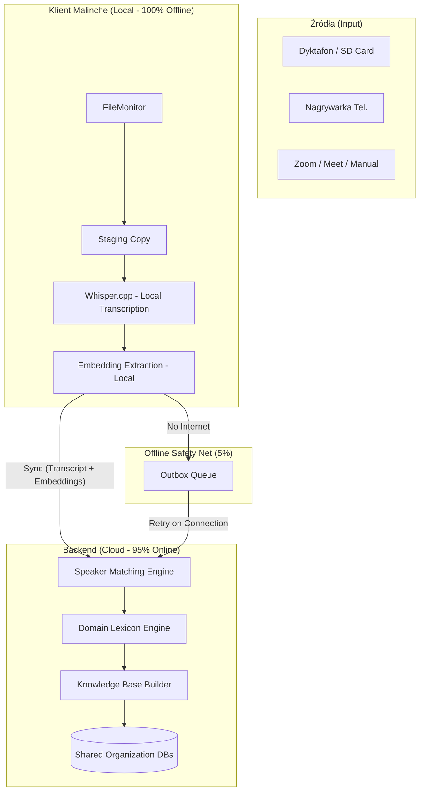
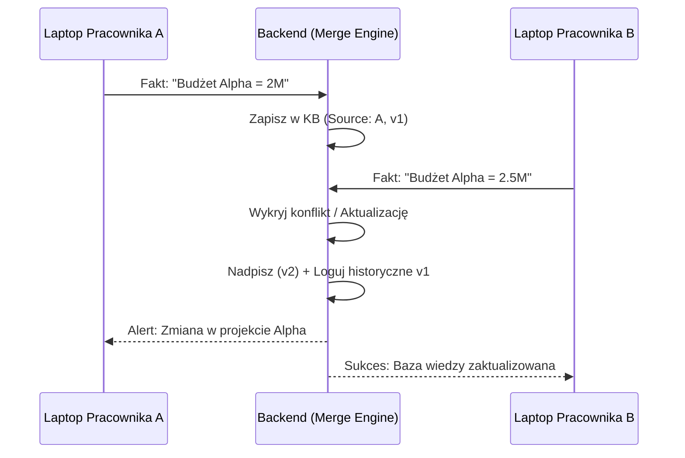

# Analiza architektoniczna: Knowledge Base Engine (PRO)

## 1. Wstęp i Wizja Produktu

Zarządzanie wiedzą w organizacjach operujących "w terenie" oraz hybrydowo (spotkania online) jest kluczowym wyzwaniem. Wiedza przekazywana ustnie – podczas narad na budowie, przesłuchań w kancelarii, czy spotkań na Zoom – często ginie w szumie informacyjnym.

Malinche (v2.2.0+) przekształca proces z "nagrywania audio" w "budowanie aktywnej bazy wiedzy".

### Główne cele:
1. **Wielokanałowość:** Obsługa dyktafonów (USB/SD), nagrywarek telefonicznych oraz spotkań online (Zoom/Meet).
2. **Atrybucja:** Precyzyjne przypisanie wypowiedzi do osób niezależnie od źródła dźwięku.
3. **Adaptacja:** Nauka specyficznego języka organizacji (Domain Lexicon).
4. **Konsolidacja:** Łączenie faktów z wielu nagrań różnych pracowników w jeden spójny graf wiedzy (Knowledge Base).

---

## 2. Wysokopoziomowa Architektura (Hybrid Cloud)

Architektura opiera się na zasadzie **Local-first Processing, Cloud-primary Intelligence**. Transkrypcja zawsze dzieje się lokalnie, natomiast zaawansowana analiza wiedzy i diaryzacja dla organizacji odbywają się w chmurze (transrec-backend), co gwarantuje spójność danych w całej firmie.



---

## 3. Źródła nagrań i ich specyfika

System automatycznie rozpoznaje typ źródła i dostosowuje pipeline przetwarzania:

1. **Dyktafony / Rejestratory (Mono/Stereo):**
   - Często niska jakość, echo, szum tła.
   - Wymaga zaawansowanej diaryzacji opartej na ML (embeddingi głosowe).
2. **Zoom / Google Meet (Multi-track):**
   - Jeśli plik zawiera oddzielne ścieżki audio dla uczestników, system stosuje **Trivial Diarization** (100% pewności bez użycia ML).
   - Obsługiwane przez "Watched Folder" lub ręczne przeciągnięcie pliku.
3. **Nagrywarki telefoniczne:**
   - Specyficzna kompresja audio.

---

## 4. Komponent 1: Speaker Diarizer (Cloud-Primary)

**Cel:** Odpowiedź na pytanie "Kto mówi kiedy?" w skali całej organizacji.

### 4.1. Strategia 95/5
- **95% przypadków (Online przy przetwarzaniu):** System wysyła do backendu tekst transkrypcji oraz **voice embeddings** (wektory numeryczne, nie surowe audio). Backend dopasowuje je do `Shared Speaker DB`.
- **5% przypadków (Offline):** Nagranie zostaje przetworzone lokalnie (tylko transkrypcja), a proces diaryzacji trafia do kolejki `Outbox`. Po odzyskaniu sieci markdown jest wzbogacany o dane mówców.

### 4.2. Modele i prywatność
- **Lokalnie:** Lekki model do ekstrakcji embeddingów (~17MB).
- **Cloud:** Ciężkie modele (pyannote.audio) na serwerach z GPU dla najwyższej jakości.
- **Opcja PRO:** Organizacja może wybrać między wysyłaniem tylko embeddingów (wyższa prywatność) a surowym audio (wyższa jakość diaryzacji).

---

## 5. Komponent 2: Domain Lexicon Engine

**Cel:** Budowanie wspólnego słownika branżowego organizacji.

### 5.1. Współdzielona Wiedza
- Gdy pracownik A otaguje termin "SCM" jako "Supply Chain Management", termin ten staje się dostępny dla pracownika B.
- System automatycznie poprawia transkrypcje wszystkich pracowników na podstawie centralnego słownika.

---

## 6. Komponent 3: Knowledge Base Builder

**Cel:** Transformacja transkrypcji w ustrukturyzowane fakty i graf wiedzy.

### 6.1. Knowledge Merging & Conflict Resolution
To serce systemu dla organizacji. Backend pełni rolę **Merge Engine**:



---

## 7. Ryzyka i decyzje architektoniczne

- **Prywatność (RODO):** Voice fingerprints są traktowane jako dane biometryczne. Wymagana zgoda użytkownika i polityka retencji.
- **Merge Conflicts:** Największe wyzwanie to sytuacja, gdy dwaj pracownicy niezależnie tagują tę samą osobę różnymi nazwiskami. Backend musi posiadać mechanizm deduplikacji i scalania profili (Manual Merge).
- **Zależność od sieci:** Internet jest wymagany do pełnej funkcjonalności PRO, ale system jest odporny na przerwy dzięki kolejkowaniu asynchronicznemu.

---

## 8. Tiers Licencyjne (Strategia PRO)

| Funkcja | FREE | PRO Individual | PRO Organization |
|---------|------|---------------|-----------------|
| Transkrypcja (Whisper) | ✅ | ✅ | ✅ |
| AI Summary & Tagi | ❌ | ✅ | ✅ |
| Speaker Diarization | ❌ | ✅ (Local) | ✅ (Shared Cloud) |
| Domain Lexicon Engine | ❌ | ❌ | ✅ (Shared) |
| Knowledge Base Builder| ❌ | ❌ | ✅ (Shared) |
| Multi-source (Zoom/SD) | ✅ | ✅ | ✅ |

---

## 9. Przykładowy przepływ integracji (Code Snippet)

```python
# Szkic pipeline'u obsługującego Cloud Sync i Offline Queue
def process_audio_batch(self, audio_files: List[Path]):
    for audio in audio_files:
        # 1. Zawsze lokalnie (szybka transkrypcja)
        transcript = self.transcriber.transcribe_local(audio)
        embeddings = self.diarizer.extract_embeddings_local(audio)
        
        # 2. Próba syncu z Cloud (Diarization, Lexicon, KB)
        payload = {
            "transcript": transcript,
            "embeddings": embeddings,
            "metadata": self.get_metadata(audio)
        }
        
        if self.network.is_online():
            result = self.backend.process_pro_features(payload)
            self.markdown_gen.create_final(audio, result)
        else:
            # 3. Fallback: Kolejkuj do późniejszego przetworzenia
            self.outbox.add(payload)
            self.markdown_gen.create_draft(audio, transcript)
```

---
> **Powiązane dokumenty:**
> - [ARCHITECTURE.md](../ARCHITECTURE.md) - Architektura systemu
> - [PUBLIC-DISTRIBUTION-PLAN.md](../PUBLIC-DISTRIBUTION-PLAN.md) - Plan v2.0.0
